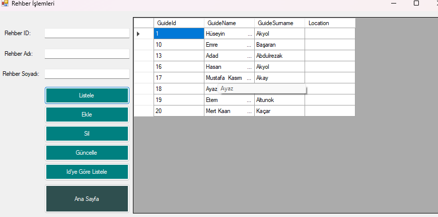
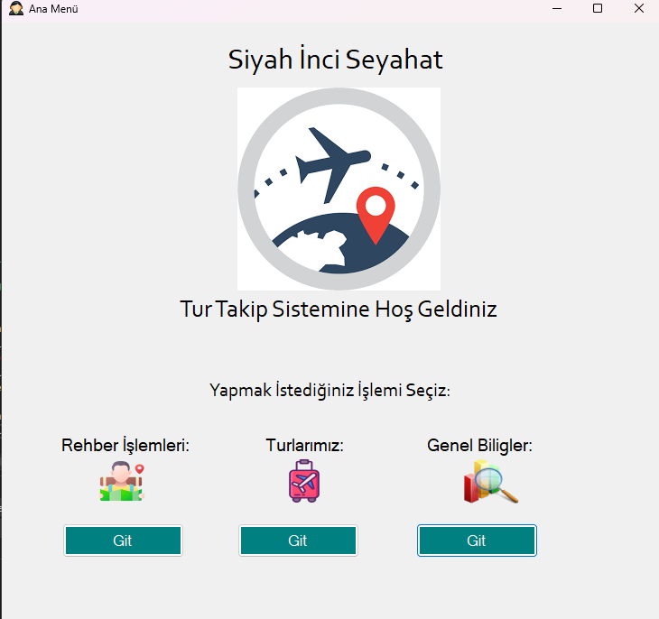
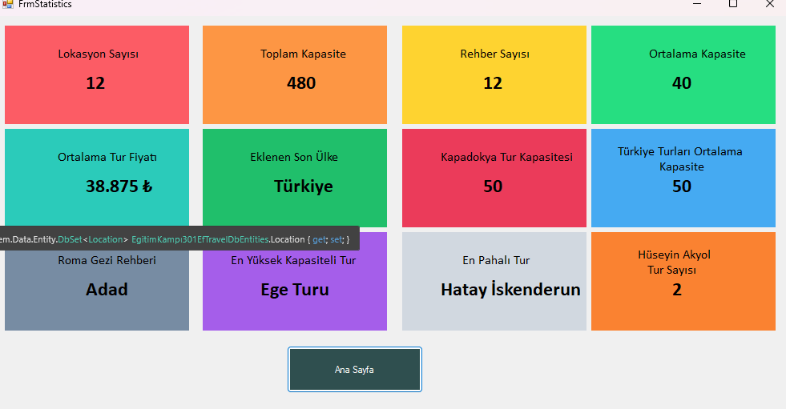
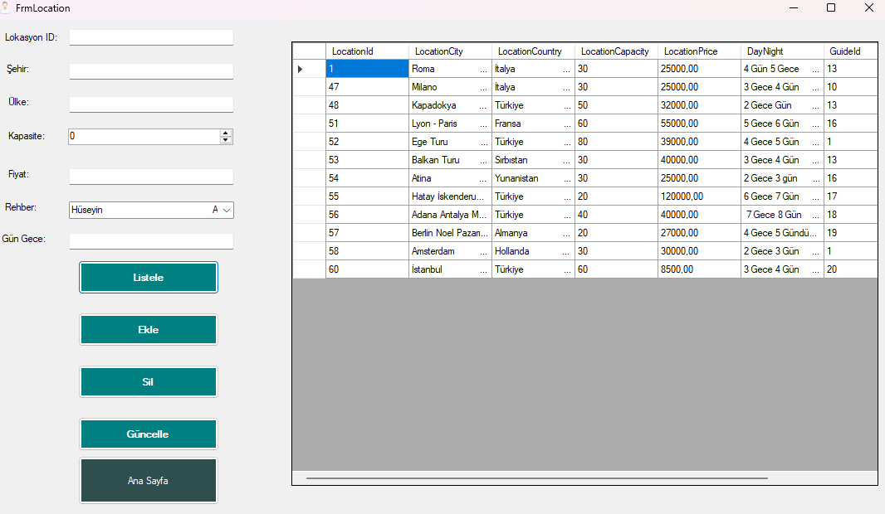

# Tour Management System / Tur Yönetim Sistemi

A basic desktop automation project developed in C# using Windows Forms and Microsoft SQL Server.  
The system allows you to manage tour information, guides, and view basic statistics.

C# ile Windows Forms ve Microsoft SQL Server kullanılarak geliştirilmiş temel bir masaüstü otomasyon projesidir.  
Tur bilgilerini, rehberleri yönetmeyi ve temel istatistikleri görüntülemeyi sağlar.

---

##  Technologies Used / Kullanılan Teknolojiler

- **Programming Language / Programlama Dili**: C#
- **Framework**: .NET (Windows Forms)
- **Database / Veritabanı**: Microsoft SQL Server (MSSQL)
- **Development Environment / Geliştirme Ortamı**: Visual Studio

---

##  Features / Özellikler

## Main Form / Ana Sayfa
- Navigation between different forms  
- Farklı formlar arasında geçiş imkanı

## Guide Management / Rehber İşlemleri
- Add, edit, delete, and view guides  
- Rehber ekleme, düzenleme, silme ve listeleme

## Tour List / Tur Listesi
- Display and manage available tours  
- Mevcut turların görüntülenmesi ve yönetimi

##  Statistics Form / İstatistik Formu
- View summary statistics about tours and guides  
- Turlar ve rehberlerle ilgili temel istatistiklerin görüntülenmesi

---

## Project Type / Proje Türü

- Desktop application with local database  
- Yerel veritabanı kullanan masaüstü uygulama  
- No online payment or web integration  
- Online ödeme veya web entegrasyonu yoktur

---

>    This project was developed for educational purposes to practice database operations and form-based C# development.  
>    Bu proje, veritabanı işlemleri ve form tabanlı C# geliştirmeyi öğrenmek amacıyla yapılmıştır.

##  Screenshots / Ekran Görüntüleri

##  Guidepage / Rehber Sayfası

##  Homepage / Ana Sayfa

## Statistics / İstatistik Sayfası

## Tourpage / Tur Sayfası

##  Developer / Geliştirici

**Hüseyin Akyol**  
[GitHub Profilim](https://github.com/Huseyinnakyolll)

